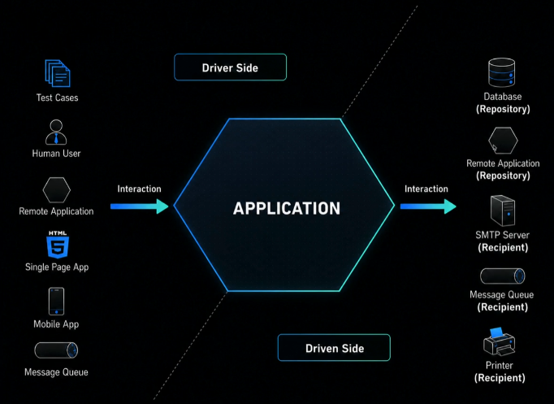

# Fundamentos da Arquitetura Hexagonal (Ports and Adapters)

## 

## Por que o nome "Arquitetura Hexagonal"?

O verdadeiro nome desse padrão arquitetural é **Ports and Adapters**, criado por Alistair Cockburn.

O termo **hexagonal** não existe porque o número seis tenha algum significado especial. O hexágono foi utilizado apenas como uma representação visual que permite desenhar várias portas e adaptadores ao redor da aplicação, sem transmitir a ideia equivocada de uma arquitetura estritamente em camadas.

Em arquiteturas tradicionais em camadas, muitas vezes o desenho sugere um fluxo único de dependências (de cima para baixo). Já o hexágono evidencia que a aplicação pode se comunicar com diversos agentes externos por meio de múltiplas portas e adaptadores.

O objetivo principal é deixar claro que o **núcleo da aplicação** deve ser independente de tecnologias externas, como:

- Banco de dados
- Frameworks
- Interfaces gráficas
- APIs externas
- Sistemas de mensageria
- Serviços de autenticação

---

## Relação com o SOLID

A Arquitetura Hexagonal possui forte relação com os princípios SOLID, especialmente o **SRP (Single Responsibility Principle)**.

O SRP estabelece que uma classe ou módulo deve possuir apenas uma razão para mudar, ou seja, uma única responsabilidade bem definida.

Na Arquitetura Hexagonal, cada componente tende a ter uma responsabilidade específica:

- O núcleo da aplicação contém as regras de negócio.
- Os adaptadores de entrada recebem comandos externos.
- Os adaptadores de saída realizam integrações com sistemas externos.
- As portas definem contratos de comunicação.

Essa separação reduz o acoplamento e facilita a manutenção e a evolução do sistema.

---

## Drivers (Adaptadores de Entrada)

Uma das responsabilidades da arquitetura é separar quem **inicia o fluxo da aplicação** de quem **executa as regras de negócio**.

Os componentes responsáveis por iniciar esse fluxo são chamados de **Drivers** ou **Adaptadores de Entrada (Inbound Adapters)**.

Eles recebem comandos vindos de fontes externas e os encaminham para o núcleo da aplicação.

Exemplos:

- Controllers REST
- Endpoints GraphQL
- Interfaces Web
- Aplicativos Mobile
- Linha de comando (CLI)
- Consumidores de filas e eventos

Fluxo simplificado:

```text
Usuário → Controller → Core da Aplicação
```

ou

```text
Outro Sistema → API → Core da Aplicação
```

O driver não deve conter regras de negócio complexas. Sua responsabilidade é apenas receber a requisição, converter os dados quando necessário e acionar o caso de uso adequado.

---

## O que normalmente NÃO faz parte de uma API?

Muitas vezes existe a confusão entre API e regra de negócio.

Uma API deve ser apenas uma porta de entrada para o sistema. Portanto, geralmente não fazem parte da responsabilidade da API:

- Acesso direto ao banco de dados
- Criptografia de regras de negócio
- Regras de negócio complexas
- Integrações externas
- Lógica de persistência
- Conexões com banco de dados

Essas responsabilidades devem estar em componentes especializados da aplicação.

---

## O Core da Aplicação

O **Core** (núcleo) é a parte mais importante da Arquitetura Hexagonal.

Nele ficam:

- Regras de negócio
- Casos de uso
- Entidades do domínio
- Objetos de valor (Value Objects)
- Contratos (Ports)

O Core não deve conhecer detalhes de infraestrutura.

Por exemplo, uma regra de criação de conta não deve saber se os dados serão salvos em:

- PostgreSQL
- MySQL
- MongoDB
- Arquivo
- API externa

Essa decisão fica a cargo dos adaptadores.

---

## Services no Domínio

É comum encontrar componentes chamados de **Services** dentro do Core da aplicação.

O termo _Service_ não significa necessariamente uma classe que faz tudo. Pelo contrário, um Service deve agrupar comportamentos relacionados a uma área específica do domínio.

Exemplo:

```text
AccountService
```

Esse serviço pode conter regras relacionadas ao gerenciamento de contas:

- Criar conta
- Encerrar conta
- Validar saldo
- Transferir valores

O importante é que as responsabilidades estejam relacionadas ao mesmo contexto de negócio.

---

## Ports (Portas)

As portas representam contratos que definem como o Core se comunica com o mundo externo.

Normalmente são representadas por interfaces.

Exemplo:

```typescript
interface AccountRepository {
  save(account: Account): Promise<void>;
  findById(id: string): Promise<Account>;
}
```

O Core conhece apenas a porta (interface), não a implementação.

---

## Adapters (Adaptadores)

Os adaptadores implementam as portas.

Exemplo:

```typescript
class PostgresAccountRepository implements AccountRepository {
  // implementação utilizando PostgreSQL
}
```

ou

```typescript
class MongoAccountRepository implements AccountRepository {
  // implementação utilizando MongoDB
}
```

Dessa forma, é possível trocar tecnologias sem alterar as regras de negócio.

---

## Benefícios da Arquitetura Hexagonal

### Baixo acoplamento

As regras de negócio ficam desacopladas de frameworks e tecnologias externas.

### Facilidade para testes

É possível testar o Core sem depender de banco de dados, APIs ou infraestrutura.

### Flexibilidade tecnológica

A troca de banco de dados, frameworks ou provedores externos se torna mais simples.

### Maior manutenibilidade

Cada componente possui uma responsabilidade clara e bem definida.

### Longevidade da aplicação

O domínio de negócio permanece estável mesmo quando a infraestrutura muda.

---

## Regra mais importante

> O núcleo da aplicação não deve depender da infraestrutura.
>
> A infraestrutura deve depender do núcleo da aplicação.

Essa é uma das ideias centrais da Arquitetura Hexagonal e o principal motivo pelo qual ela promove sistemas mais desacoplados, testáveis e fáceis de evoluir.
