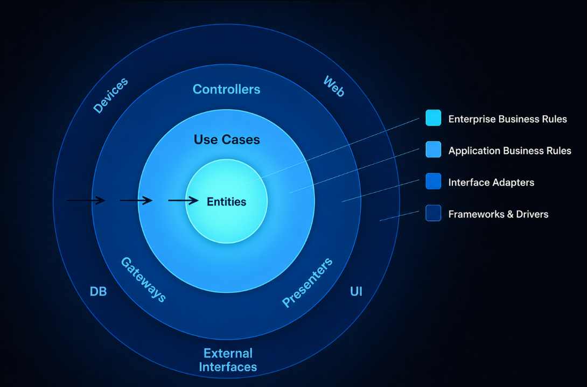
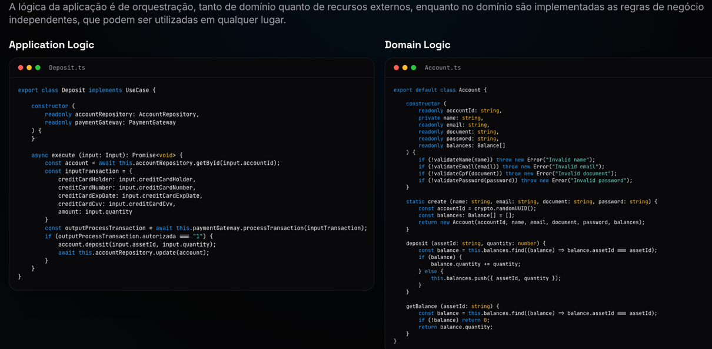
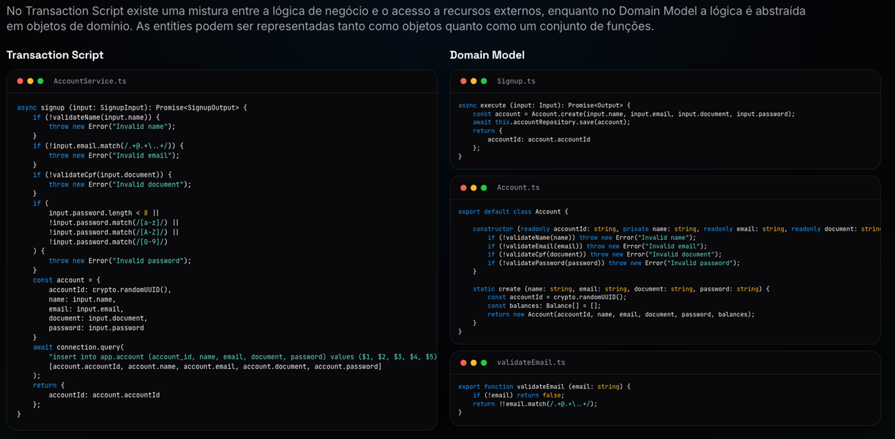

# Fundamentos da Clean Architecture

> O centro da sua aplicação não é o banco de dados, o framework ou as bibliotecas que ela possa estar utilizando. O centro da sua aplicação são os **Use Cases**.
> _Robert C. Martin_

A Clean Architecture é muito orientada a **Use Cases**. Ela utiliza **Domain Model**, mas o centro são os Use Cases.



## Dependency Rule

- São as linhas pretas fazendo a ligação entre as camadas.
- Em linhas gerais, ela diz que quem está fora conhece (ou pode conhecer) quem está dentro, mas quem está dentro não pode conhecer quem está fora.

## Entities

- Representam as regras de negócio independentes, ou seja, que podem ser utilizadas pelos Use Cases para compor as regras de negócio da aplicação.
- As Entities podem ser representadas tanto por objetos quanto por um conjunto de funções.

### Exemplos de regras de negócio independentes

- O documento é válido?
- Qual é a distância entre duas coordenadas?
- Existe match entre uma ordem de compra e uma ordem de venda?

> As Entities devem ser independentes e reutilizáveis. Não podem depender de recursos externos, como banco de dados ou integrações.

### Exemplos de Entities

- Account
- UUID
- Document
- Email
- Name
- Password

## Use Cases

- São responsáveis pelo comportamento da aplicação, demandado pelos drivers.
- Orquestram as regras de negócio independentes, implementadas pelas Entities, e os recursos externos, como banco de dados, filas e APIs.

### Exemplos

- Signup
- Deposit
- PlaceOrder
- GetAccount
- ExecuteOrder



<details>

<summary><b>Definindo entradas e saídas</b></summary>

### Definindo entradas e saídas

Nos Use Cases, as entradas e saídas são sempre DTOs (_Data Transfer Objects_), e não Entities.

Isso é importante para não criar acoplamentos desnecessários entre as camadas externas e o domínio.

> As necessidades de um Use Case nem sempre combinam com a estrutura das Entities. Além disso, normalmente as Entities possuem suas propriedades encapsuladas, tornando ainda mais inviável essa utilização.

```typescript
type Input = {
  name: string;
  email: string;
  document: string;
  password: string;
};

type Output = {
  accountId: string;
};

export class Signup implements UseCase {
  constructor(readonly accountRepository: AccountRepository) {}

  async execute(input: Input): Promise<Output> {
    const account = Account.create(
      input.name,
      input.email,
      input.document,
      input.password,
    );

    await this.accountRepository.save(account);

    return {
      accountId: account.accountId,
    };
  }
}
```

</details><br>

> **Use Case é diferente de CRUD?**
>
> Um CRUD é composto por operações de **Create**, **Read**, **Update** e **Delete**, enquanto um Use Case nem sempre executa esse tipo de operação. Muitas vezes ele realiza uma combinação dessas operações, envolvendo diferentes tabelas e outros tipos de recursos externos.

## Interface Adapters

- Funcionam como uma ponte entre o Core da aplicação e os recursos externos.
- Podem ser representados por código SQL, mapeamento de URLs, Gateways, Controllers, Endpoints ou APIs externas.

## Uso do padrão Domain Model

- A Clean Architecture utiliza o padrão **Domain Model** em vez de **Transaction Script** como estratégia de design.
- As regras de negócio são concentradas na camada de domínio quando pensamos em independência e reuso.
- Porém, o Use Case possui um papel fundamental de orquestração.
- É a junção dessas duas camadas que abstrai a lógica da aplicação.


